# Trabajo Final de Ingenieria de Software I: Pagina Web de eventos relacionados a computacion

## Proposito del Proyecto
Debido a los grandes avances y nuevas tecnologias relevantes para la sociedad de computacion que comprende entre investigadores, profesores, empresas, estudiantes y demas personas aficionados; esta pagina web pretende ser util para que los ponentes puedan notificar de sus proximos eventos a traves de una interfaz simple, y asi estos puedan mostrar mas interes a los temas tratados y agrandar la comunidad de ciencia de la computacion.

## Funcionalidades
La pagina web presenta entre sus principales funcionalidades:

### - Visualizar a traves de una interfaz grafica eventos relacionados a la computacion

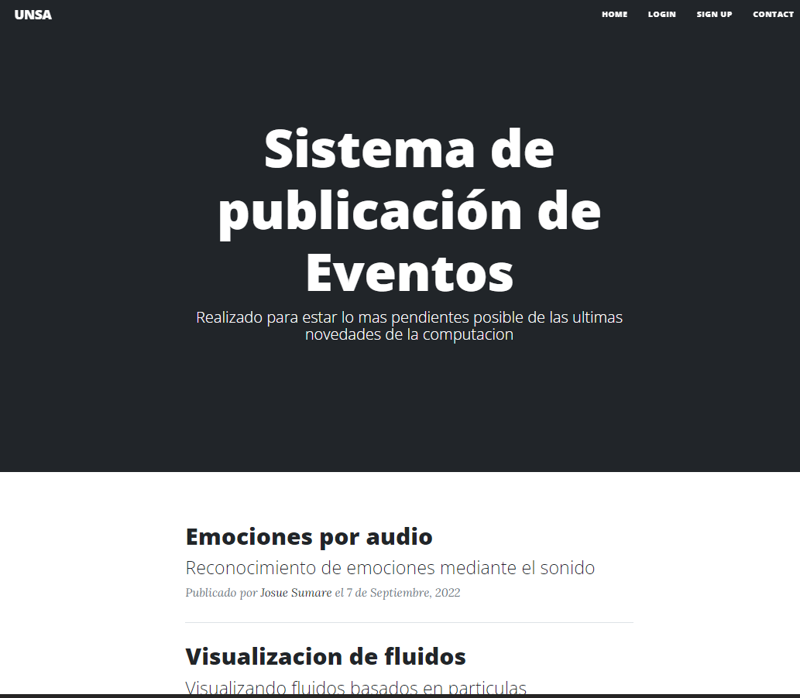

### - Obtener mas informacion de los eventos

### - Acceder a los perfiles de los ponentes

### - Interaccion a traves de sesiones

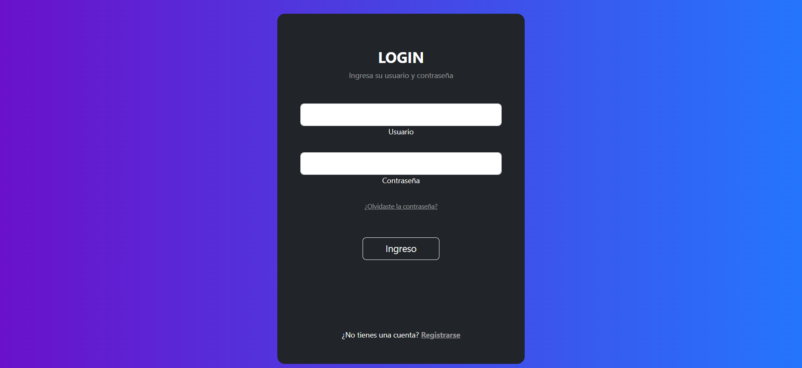

## Estilos de Programacion usados

### Code Golf
Un estilo de programacion Code Golf se utiliza en los archivos de la carpeta backend/blueprints de la aplicacion ya que cuentan con metodos de pocas lineas, que dependiendo de la complejidad de la peticion JSON a la API pueden ser mas largas.

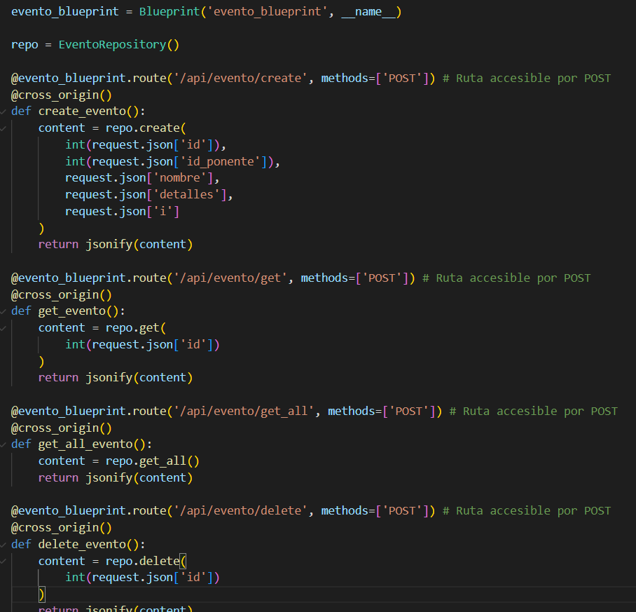

Captura de pantalla del archivo backend/blueprints/evento_blueprint.py

### Pipeline
Este estilo con programacion orientado a objetos es usado en las clases de backend/models ya que estas clases contienen funciones que retornan datos que no son compartidos entre otras funciones de la misma clase.

Captura de pantalla del archivo backend/models/usuario.py

### Persistent Tables
Los archivos de repositorio de la parte de infraestructura utilizan el estilo de programacion de persistent tables ya que al establecer una conexion directa con la base de datos asociada, cuentan con lineas de queries para la extraccion y modificacion de la Base de Datos.

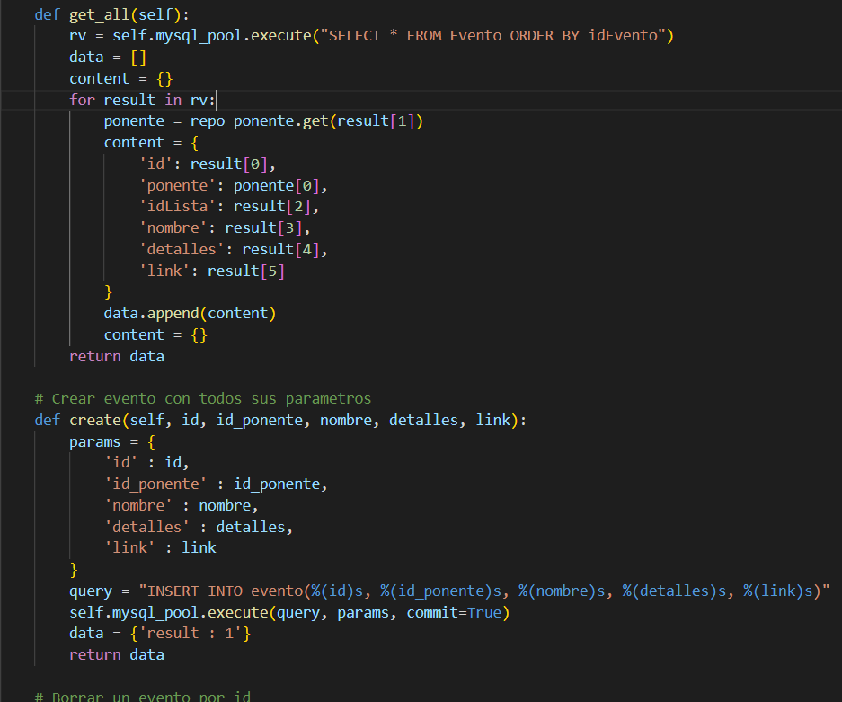

Captura de pantalla del archivo backend/infrastructure/evento_repository.py

## Practicas de Codigo Legible
Algunas de las practicas de codigo legible utilizadas son:

### Comentarios y Documentacion
El codigo esta bien comentado y documentado en las partes importantes y en las que no se pueden sobreentender a simple vista. Ademas se ha evitado el uso de comentarios obvios e innecesarios.

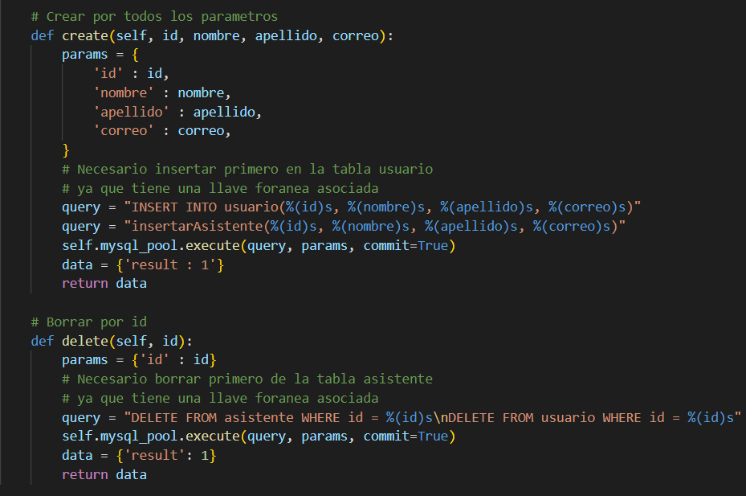

Captura de pantalla del archivo backend/infrstructure/asistente_repository.py

### Indentacion Consistente
La indentacion es constante en los archivos .py (Y de todas maneras el lenguaje obliga a tenerla) con indentaciones de 4 espacios blancos, representada normalmente con la tecla Tab del teclado

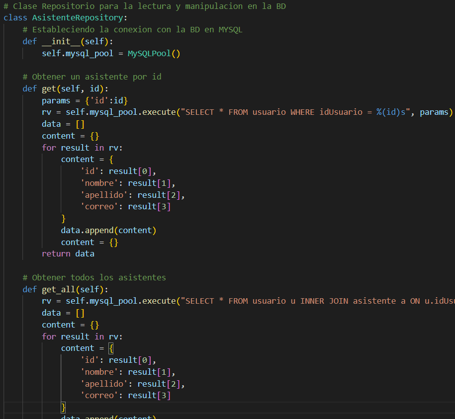

Captura de pantalla del archivo backend/infrastructure/asistente_repository.py

### Capitalize SQL Special Words
Se utiliza en las palabras pertenecientes a SQL para identificar mejor nuestros parametros y columnas.

Captura de pantalla del archivo backend/infrastructure/asistente_repository.py
### Sistema Consistente de Nombramiento
Se utiliza un sistema consistente de nombramiento para las variables, en la que varias variables temporales se vuelven a usar para representar una misma logica. El codigo usado con python se viene desarrollando con snake_casing, este estilo  nombra a las variables siempre en minuscula y si se quieren representar espacios o separacion de palabras se utiliza un guin bajo _, solo existe la excepcion para las clases donde cada clase se escriba empezando por una mayuscula y si existe separacion de palabras se hace con una mayuscula.

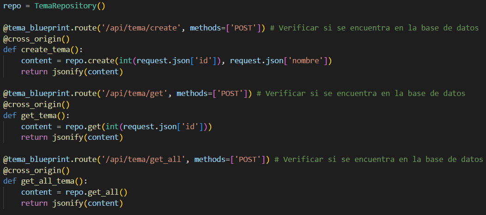

Captura de pantalla del archivo backend/infrastructure/tema_blueprint.py

### Organizacion de Archivos y Carpetas
Los archivos de la aplicacion estan organizados en las carpetas backend y frontend, en backend ira la parte relevante para la API y la conexion a la base de datos como la infraestructura, los modelos y blueprints o rutas de la aplicacion, el frontend contara con las plantillas que serviran para representar datos dinamicos obtenidos de la API, ademas se encuentran tambien los archivos estaticos (imagenes, codigo css o js)

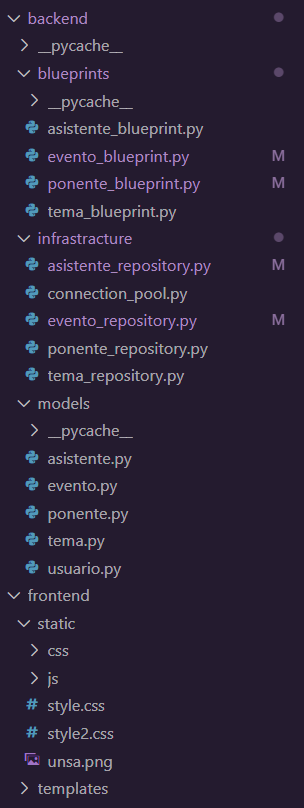

Captura de pantalla de organizacion de carpetas en VS Code

### Longitud de lineas limitada
Al ser las lineas horizontales largas una mala practica se ha optado por hacer algunas reducciones de lineas, como por ejemplo guardando informacion en variables temporales, y si no es posible aun asi de reducirlas, de la forma como se ve en la siguiente imagen.

Captura de pantalla del archivo backend/infrastructure/ponente_repository.py

## Principios SOLID

### Single Resposibilty (S)
Cada archivo y clase presenta solo una funcionalidad, no mezcladas con otras. Por ejemplo, los repositorios realizan las peticiones directas a la base de datos, los blueprints, retornan datos en formato json a la API, y las clases de modelos representan a las entidades.

Diferencia entre Evento para su repositorio, modelo y blueprint

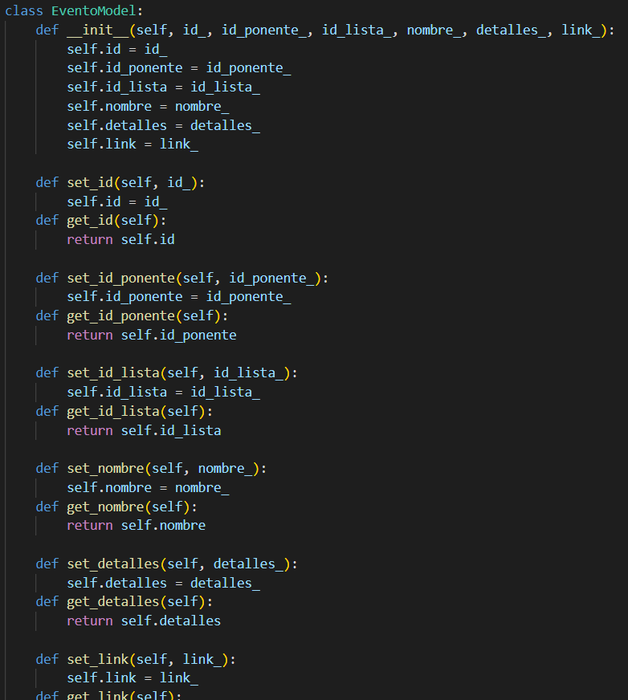

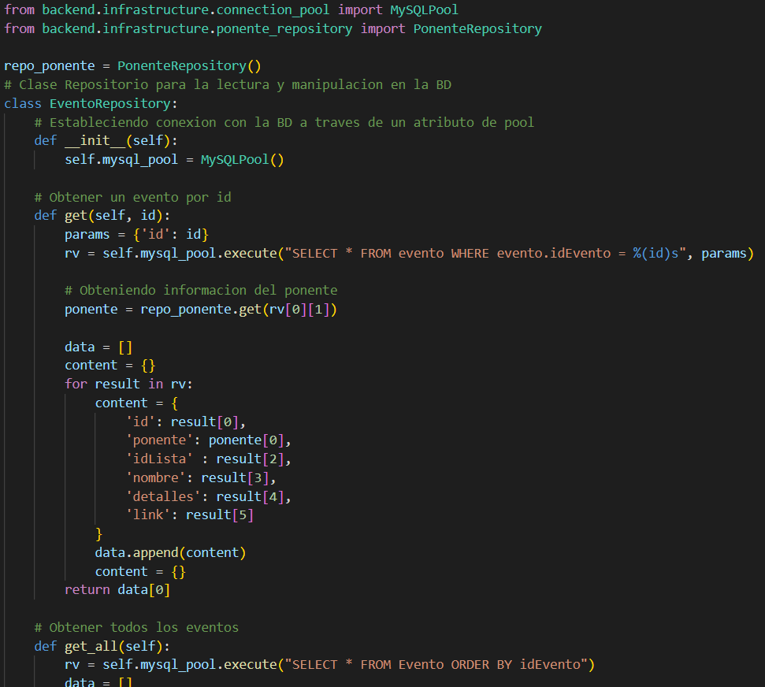

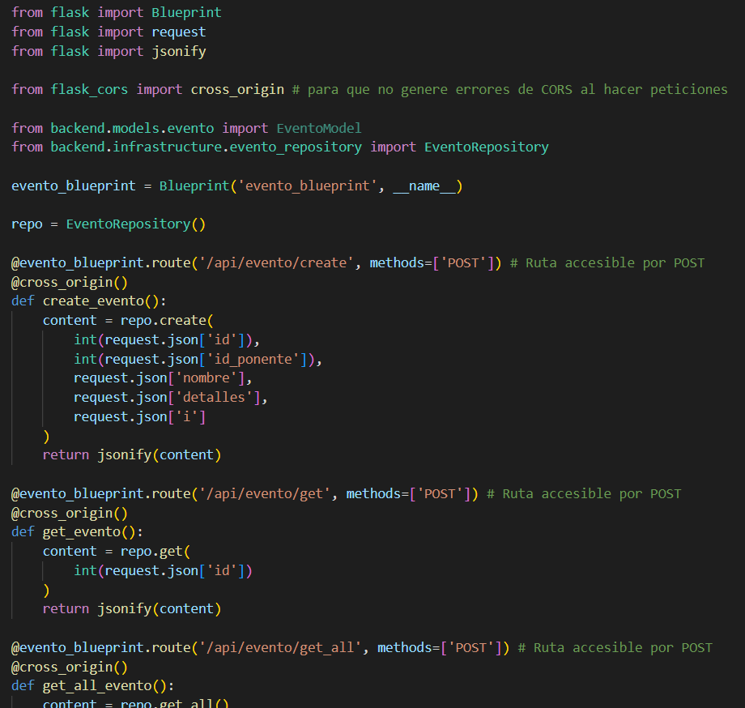

Capturas de pantalla de los archivos backend/models/evento.py, backend/infrastructure/evento_repository.py y backend/blueprints/evento_blueprint.py

### Open / Closed (O)
Al usar modelos como una representacion de las entidades en los archivos de backend, se pueden anadir funcionalidades sin tener que modificar la base de datos.

Captura de pantalla del archivo backend/models/evento

### Dependency Inversion (D)
Si se realiza un cambio a una subclass, la clase superior no debe verse afectada por tal cambio, como podemos ver en las clases del modelo de Usuarios y Name, Usuario depende de Name, pero los cambios que se hagan a Usuario, no debera afectar el comportamiento de Name.

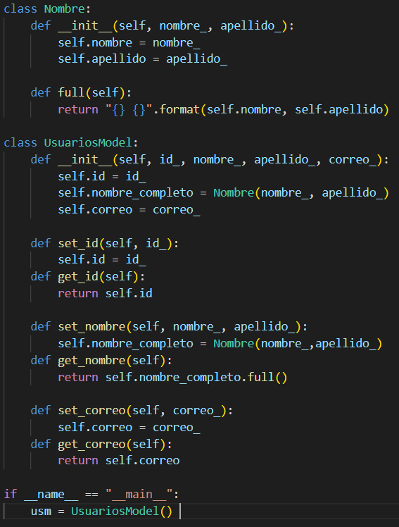

Captura de pantalla del archivo backend/models/usuario.py

## Conceptos DDD Aplicados
Domain Driven Design (DDD) es una práctica de desarrollo de software que pone el acento en el Dominio del Negocio como faro del proyecto y en su Modelo como herramienta de comunicación entre negocio y tecnología. 

La arquitectura implementada se divide en la siguiente estructura:

Arquitectura del proyecto: 

### Interface
Esta capa contiene todo lo que interactúa con otros sistemas, como los servicios web, las interfaces RMI o las aplicaciones web, y los frontales de procesamiento por lotes. Se encarga de la interpretación, validación y traducción de los datos entrantes. También se encarga de la serialización de los datos salientes, como HTML o XML a través de HTTP para los navegadores web o los clientes de servicios web.

### Application
La capa de aplicación se encarga de dirigir el flujo de trabajo de la aplicación en función de los casos de uso que se presentaron.
Estas operaciones son independientes de la interfaz y pueden ser tanto sincrónicas como basadas en señales. Esta capa es muy adecuada para abarcar las transacciones, el registro de alto nivel y la seguridad.

La capa de aplicación es poco exigente en cuanto a la lógica de dominio: se limita a coordinar los objetos de la capa de dominio para realizar el trabajo real.

### Domain
La capa de dominio es el corazón del software, es el núcleo de la lógica de negocio.
Aqui se realizan tareas como determinar si un evento de manipulación debe ser registrado y cómo la entrega de una carga se ve afectada por la manipulación.

La estructura y la denominación de los agregados, las clases y los métodos de la capa deberían seguir el lenguaje del grupo, y cualquier miembro debería ser capaz de explicar a un experto en el dominio cómo funciona cierta parte del software dibujando unos cuantos diagramas sencillos y utilizando los nombres reales de las clases y los métodos del código fuente.

## Esfuerzo de cada integrante (en orden alfabetico):

- Casaverde Aleman Moises Alejandro: Implementacion de API, llamadas a la misma, creacion de varios blueprints e infraestructura
- Castillon Urquiza Levi Joel:
- Chambi Ytusaca Samuel Felipe Maximiliano: Implementacion de templates (Log In, Sign Up), diseño de README.md e infraestructura DDD. 
- Choquehuanca Anconeyra Roy Angel: Creación de la base de datos, tanto modelo lógico, conceptual y fisico. Con procedimientos almacenados y ejemplos en cada tabla.
- Pino Huarsaya Angie Alexandra:  Implementación de Templates (Sign Up, Inicio)
- Sumare Uscca Josue Gabriel: Implementacion de la secuencia de acciones de la aplicación(fujo de acciones de todas las pantallas).
- Villa Herrera Alejandro Antonio: Implementacion de API, diseño de models, diseño Readme, modificacion de blueprints e infraestructura
- Yauri Ituccayasi Julio Enrique: 

© Copyright 2022 All rights reserved
